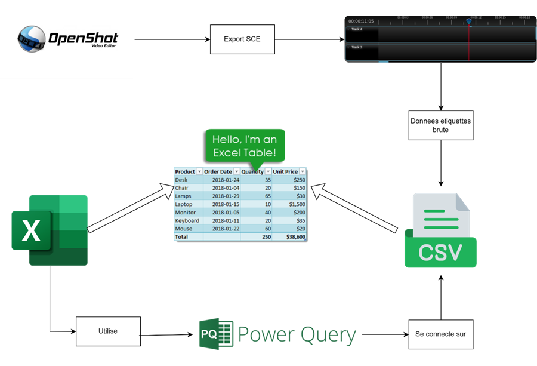
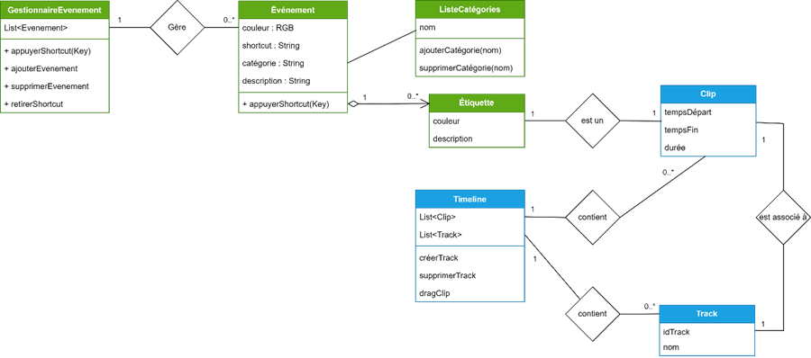
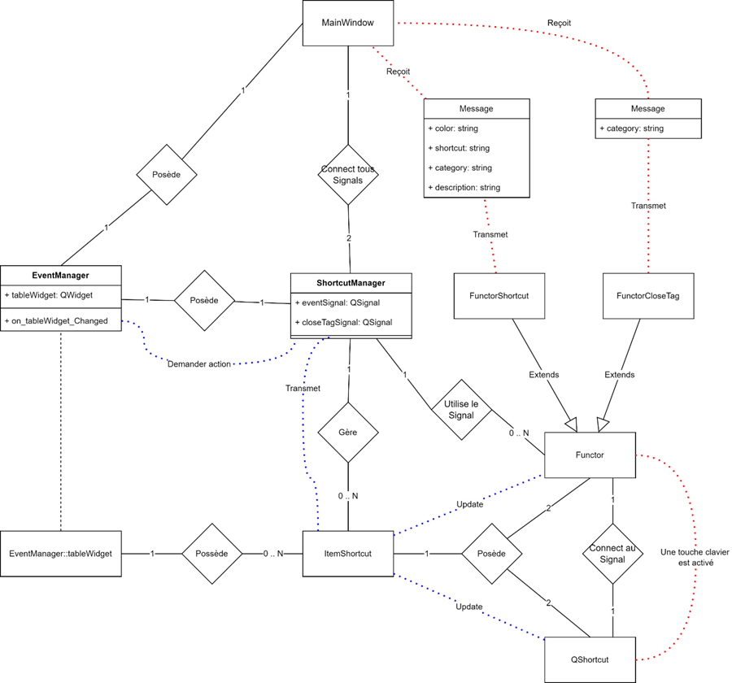

## SCE Features

* Added a module to manage events
* Create tags directly on the timeline
* Export the result of the analysis to an Excel file
* Events and Tags are saved directly into the Openshot project

## Tutorial

Watch the official [step-by-step video tutorial](https://www.youtube.com/watch?list=PLymupH2aoNQNezYzv2lhSwvoyZgLp1Q0T&v=1k-ISfd-YBE), or read the official [user-guide](https://www.openshot.org/user-guide/):


## Dependencies

Although installers are much easier to use, if you must build from 
source, here are some tips: 

OpenShot is programmed in Python (version 3+), and thus does not need
to be compiled to run. However, be sure you have the following 
dependencies in order to run OpenShot successfully: 

*  Python 3.0+ (http://www.python.org)
*  PyQt5 (http://www.riverbankcomputing.co.uk/software/pyqt/download5)
*  libopenshot: OpenShot Library (https://github.com/OpenShot/libopenshot)
*  libopenshot-audio: OpenShot Audio Library (https://github.com/OpenShot/libopenshot-audio)
*  FFmpeg or Libav (http://www.ffmpeg.org/ or http://libav.org/)
*  GCC build tools (or MinGW on Windows)

## Installation for Developpers

```sh
#Reference : https://github.com/OpenShot/libopenshot/wiki/Linux-Build-Instructions

###############################
#Getting the Latest Source Code
###############################
sudo apt-get update
sudo apt-get install build-essential
sudo apt-get install git

git clone https://github.com/OpenShot/libopenshot-audio.git
git clone https://github.com/OpenShot/libopenshot.git
git clone https://github.com/RiverChriss/openshot-qt-SCE

sudo apt-get install python3-pip
pip install PyQtWebEngine
python3 -m pip install cx_freeze --upgrade


#Configuring your Development Environment
sudo add-apt-repository ppa:openshot.developers/libopenshot-daily
sudo apt-get update
sudo apt-get install openshot-qt
sudo apt-get install cmake
sudo apt-get install libx11-dev
sudo apt-get install libasound2-dev
sudo apt-get install libavcodec-dev
sudo apt-get install libavdevice-dev
sudo apt-get install libavfilter-dev
sudo apt-get install libavformat-dev
sudo apt-get install libavresample-dev
sudo apt-get install libavutil-dev
sudo apt-get install libfdk-aac-dev
sudo apt-get install libfreetype6-dev
sudo apt-get install libjsoncpp-dev
sudo apt-get install libmagick++-dev
sudo apt-get install libopenshot-audio-dev
sudo apt-get install libprotobuf-dev
sudo apt-get install libqt5svg5-dev
sudo apt-get install libswscale-dev
sudo apt-get install libunittest++-dev
sudo apt-get install libxcursor-dev
sudo apt-get install libxinerama-dev
sudo apt-get install libxrandr-dev
sudo apt-get install python3-zmq
sudo apt-get install libzmq3-dev
sudo apt-get install pkg-config
sudo apt-get install python3-dev
sudo apt-get install protobuf-compiler
sudo apt-get install qtbase5-dev
sudo apt-get install libqt5svg5-dev
sudo apt-get install libxcb-xfixes0-dev
sudo apt-get install qtmultimedia5-dev
sudo apt-get install swig


###############################					 
#ibopenshot-audio (Build Instructions)
###############################

cd libopenshot-audio

# Tell CMake to examine the source tree in the current directory (./)
# and write a configuration for it in a build subdirectory (build/)
cmake -B build -S .

# This has cmake compile all of the default build targets in build/
cmake --build build

# This should play a test sound
./build/src/openshot-audio-demo

# This tells CMake to install everything that was compiled in build/
sudo cmake --install build

###############################
#libopenshot (Build Instructions)
###############################

cd libopenshot

# Just like before, configure...
# if not error then
cmake -B build -S .
# else
cmake -B build -S . -DCMAKE_PREFIX_PATH=$HOME/Qt/5.15.2/gcc_64/


# Build...
cmake --build build

# Test...
cmake --build build --target test


###############################
#openshot-qt (Launch Instructions)
###############################
cd openshot-qt-SCE
python3 src/launch.py
```

## Testing the installation

```sh
python3
>>> import openshot
>>> print(openshot.Version)
0.3.2
```

## Launch

To run OpenShot from the command line with an installed `libopenshot`,
use the following syntax:
(be sure the change the path to match the install or repo location 
of openshot-qt)

```sh
cd [openshot-qt folder]
python3 src/launch.py
```
    
To run with a version of `libopenshot` built from source but not installed,
set `PYTHONPATH` to the location of the compiled Python bindings. e.g.:

```sh
cd [libopenshot folder]
cmake -B build -S . [options]
cmake --build build
    
cd [openshot-qt folder]
PYTHONPATH=[libopenshot folder]/build/bindings/python \
python3 src/launch.py
```

## Schemas

### Excel export

---
### Openshot-SCE structure

---
### Signal path for tags creation (from EventsManager to Timeline/MainWindow)


## Websites

- https://www.openshot.org/  (Official website and blog)
- https://github.com/OpenShot/openshot-qt (source code and issue tracker)
- https://github.com/OpenShot/libopenshot-audio (source code for audio library)
- https://github.com/OpenShot/libopenshot (source code for video library)
- https://launchpad.net/openshot/

### Copyright & License

Copyright (c) 2008-2022 OpenShot Studios, LLC. This file is part of
OpenShot Video Editor (https://www.openshot.org), an open-source project
dedicated to delivering high quality video editing and animation solutions
to the world.

OpenShot Video Editor is free software: you can redistribute it and/or modify
it under the terms of the GNU General Public License as published by
the Free Software Foundation, either version 3 of the License, or
(at your option) any later version.

OpenShot Video Editor is distributed in the hope that it will be useful,
but WITHOUT ANY WARRANTY; without even the implied warranty of
MERCHANTABILITY or FITNESS FOR A PARTICULAR PURPOSE.  See the
GNU General Public License for more details.

You should have received a copy of the GNU General Public License
along with OpenShot Library.  If not, see <http://www.gnu.org/licenses/>.
